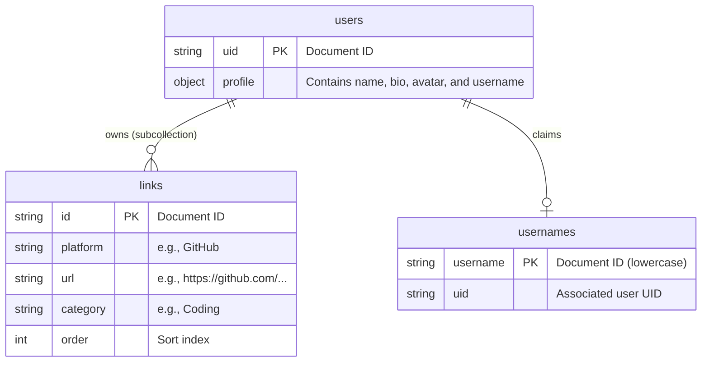

# 🔗 LinkHub — Premium Link-in-Bio Dashboard

[](https://react.dev/)
[](https://vite.dev/)
[](https://tailwindcss.com/)
[](https://firebase.google.com/)
[](LICENSE)

A premium, serverless Link-in-Bio dashboard designed for developers, creators, and professionals to aggregate and showcase their social, professional, and personal links in a sleek single-page interface.

🔗 **Live Link**: [social-links-eight-nu.vercel.app](https://social-links-eight-nu.vercel.app/)

---

## 🎯 The Problem it Solves
In the modern digital era, professional identity is fragmented across multiple platforms: developers live on GitHub, designers on Behance, writers on Medium, and creators on YouTube or LinkedIn. 

**LinkHub** solves this fragmentation by providing:
* **Centralization**: A single, beautifully styled gateway to your entire online presence.
* **Zero Bloat & Ad-Free**: Unlike commercial platforms (like Linktree), LinkHub is completely ad-free, fast, tracking-free, and open source.
* **Full Design Autonomy**: Features light/dark mode and a dynamic accent engine allowing creators to personalize their public page's aesthetics.
* **Instant Filtering**: Real-time searching and categorization to help visitors locate specific profiles (e.g., finding coding links vs. social handles instantly).

---

## 🛠️ Tech Stack
* **Frontend Core**: React 19 (functional components, custom hooks, and context API)
* **Build Tooling & Routing**: Vite 8, React Router DOM v7 (enabling dynamic path routing and fallbacks)
* **Styling & UI**: Tailwind CSS v4.0 (for layout utilities) and Vanilla CSS custom variables (`index.css`) for layout backgrounds, HSL accent themes, and glassmorphism.
* **BaaS (Backend-as-a-Service)**: Firebase Web SDK (v12.13.0)
  * **Database**: Cloud Firestore (NoSQL Document Store)
  * **Authentication**: Firebase Authentication (Google OAuth provider)
* **Assets & Illustrations**: Dicebear Avatars API (Notionists & Lorelei avatars), Platform SVG brand icons
* **Deployment/Hosting**: Configured for Vercel with client-side rewrite routing (`vercel.json`)

---

## ✨ Key Features
* **Google OAuth Authentication**: Instant, secure sign-in and account registration.
* **Dynamic Accent Engine**: Real-time theme customization. Toggles between light and dark modes with 5 curated accent colors (Indigo, Emerald, Rose, Amber, and Cyan).
* **Custom Username Claiming**: Allows users to reserve a custom URL (e.g. `linkhub.com/username` or fall back to `/p/uid`). Includes a 500ms debounced Firestore check to ensure availability and prevent route hijacking.
* **HTML5 Native Drag-and-Drop**: Fluid link reordering utilizing a custom Hook (`useDragReorder`) interacting with native browser APIs (saving state atomically in Firestore).
* **Smart Category Filters & Live Search**: Real-time search of link platforms and URLs, plus dynamic category filtering tabs (Social, Coding, Portfolio, and Custom categories).
* **Automatic Icon & Palette Matching**: Intelligently identifies platform names (like *GitHub* or *Spotify*) to display official SVG brand icons and matching highlight styling.
* **Google Favicon API Fallback**: For custom domains, LinkHub queries Google’s Favicon resolver to display the site's brand icon dynamically with built-in error handling.
* **Grouped Public Profiles**: Public profiles group saved links under distinct category headers, sorting them alphabetically (with "Portfolio" and "Coding" prioritized).

---

## 🏗️ Architecture Decisions
1. **Serverless BaaS Architecture**: By choosing Firebase, the project operates entirely serverless. The client speaks directly to Firestore via authenticated queries, removing backend latency, reducing infrastructure costs to zero, and enabling real-time UI synchronization.
2. **Username Lookup Constrained Table**: Firestore does not have native "unique column" constraints. To ensure username uniqueness, a flat `/usernames/{usernameLower}` collection was implemented, mapping lowercase usernames to user UIDs. A profile is resolved in `O(1)` by first checking this lookup document.
3. **Atomic Firestore Transactions**: During username claiming/re-claiming, the application uses `writeBatch` (Firestore atomic batch writes). If a user changes their username, three operations must succeed together: deleting the old username, writing the new username registration, and updating the username field inside the profile document. If any fail, all fail—preventing orphaned records.
4. **Vercel Routing Rewrite Rule**: Single Page Applications (SPAs) throw 404 errors when deep routing is requested directly. By configuring `vercel.json` to rewrite all routes to `/index.html`, React Router is empowered to parse paths (like `/:username`) client-side.

---

## 🗄️ Database Design (Firestore NoSQL Schema)
The database structure consists of three core collections:



### 1. User Profiles Collection (`/users/{userId}`)
* Document ID: User's Firebase Authentication UID.
* Fields:
  ```json
  {
    "profile": {
      "name": "Nithin Radarapu",
      "bio": "Developer & Creator",
      "avatar": "https://api.dicebear.com/7.x/notionists/svg?seed=Nithin",
      "username": "nithin"
    }
  }
  ```

### 2. Links Subcollection (`/users/{userId}/links/{linkId}`)
* Nested collection containing individual link objects.
* Fields:
  ```json
  {
    "platform": "GitHub",
    "url": "https://github.com/NITHINradarapu",
    "category": "Coding",
    "order": 0
  }
  ```

### 3. Usernames Collection (`/usernames/{username}`)
* Document ID: Lowercase claimed username.
* Fields:
  ```json
  {
    "uid": "aBcdEFG123456789"
  }
  ```

---

## 🔒 Authentication & Security
* **Auth Provider**: Authenticated session tokens are managed via Google Sign-In using Firebase Authentication SDK.
* **Route Protection**: Client-side routes are guarded by a custom `<ProtectedRoute>` wrapper that redirects unauthenticated requests back to `/login`.
* **Path Hijacking Defense**: Inside `/src/services/profileService.js`, a list of `RESERVED_USERNAMES` (e.g., `login`, `add`, `admin`, `settings`, `about`, `api`) is maintained. Users are blocked from claiming usernames that conflict with application routes.
* **Firestore Security Rules (`firestore.rules`)**:
  * Users profiles and links are **read-only to the public** (anyone can read, allowing anonymous visitors to view public dashboards).
  * Writes are **strictly validated**; writes to `users/{userId}` or `users/{userId}/links/{linkId}` are only authorized if `request.auth.uid == userId`.
  * For `/usernames/{username}`, a user can only create a username mapping matching their own UID, delete their own mapping, or update their own mapping.

---

## ⚡ Challenges Faced & Solutions

### 1. Drag & Drop Reordering on React 19
* **Challenge**: Popular drag-and-drop libraries (such as `react-beautiful-dnd`) have not updated their hook internals to support React 19, causing console warnings, layout glitches, or strict mode crashes.
* **Solution**: Developed a custom React Hook `useDragReorder` using standard **HTML5 Drag and Drop API** properties. To keep the UI look clean and premium, the native browser drag image is set to a transparent GIF (`dataTransfer.setDragImage`), and drag-over indicators are manually rendered using CSS variables. Once reordering completes, order changes are dispatched to Firestore via a fast `writeBatch` request.

### 2. Dynamic Route Collision with Dynamic Usernames
* **Challenge**: Setting up a dynamic path like `/:username` clashes with standard routing paths like `/login`, `/about`, and `/add` in a client-side routing environment.
* **Solution**: The routing list was carefully configured with system paths placed first. If a route matches a fallback format, a search for the username lookup document is run. If the username doesn't exist, the routing tree renders a custom `<NotFound />` component immediately instead of throwing script exceptions.

### 3. Graceful Favicon Loading for Custom Domains
* **Challenge**: For unrecognized or personal domains (like a user's personal website), displaying a generic link icon ruins the aesthetic. However, requesting random favicons directly can fail due to CORS or broken icons.
* **Solution**: Implemented an image element pointing to Google's Favicon database (`https://www.google.com/s2/favicons?domain=...`). Combined with an `onError` react callback event listener on the image tag, if the request fails or times out, the icon state transitions to the fallback SVG icon smoothly.

---

## 🚀 Live Deployment
* **Live Link**: [social-links-eight-nu.vercel.app](https://social-links-eight-nu.vercel.app/)
* **Platform**: Configured and deployed on **Vercel**.
* **Redirection rules**: Single-page application router rewrites are enabled in `vercel.json` to process client-side routes.
* **Database & Auth hosting**: Cloud Firestore and Firebase Auth are hosted on Firebase Google Cloud Platform servers.

---

## 📈 Project Status
* **Status**: `Completed`
* The application contains fully operational authentication, profiles, dynamic link management, search systems, drag-and-drop ordering, and public sharing.

---

## 💻 Local Setup & Development

### 1. Clone the repository
```bash
git clone https://github.com/NITHINradarapu/SocialLinks.git
cd SocialLinks
```

### 2. Install dependencies
```bash
npm install
```

### 3. Environment Setup
Create a `.env.local` file in the root directory and insert your Firebase Web Configuration keys:
```env
VITE_FIREBASE_API_KEY=your_api_key
VITE_FIREBASE_AUTH_DOMAIN=your_auth_domain
VITE_FIREBASE_PROJECT_ID=your_project_id
VITE_FIREBASE_STORAGE_BUCKET=your_storage_bucket
VITE_FIREBASE_MESSAGING_SENDER_ID=your_messaging_sender_id
VITE_FIREBASE_APP_ID=your_app_id
```

### 4. Run locally
```bash
npm run dev
```

---
*Developed by [Nithin Radarapu](https://github.com/NITHINradarapu)* 🚀
